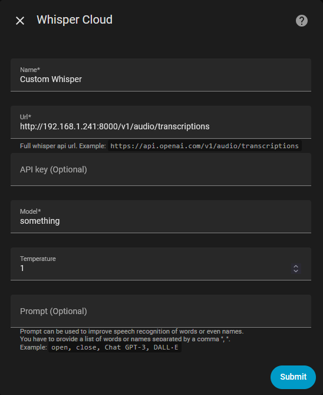

[](https://stand-with-ukraine.pp.ua)
[](https://stand-with-ukraine.pp.ua)
[](https://stand-with-ukraine.pp.ua)
[](https://stand-with-ukraine.pp.ua)

Repository: [ALERTua/stt-ukrainian-api](https://github.com/ALERTua/stt-ukrainian-api)

GitHub Docker Registry: https://github.com/ALERTua/stt-ukrainian-api/pkgs/container/stt-ukrainian-api

Docker Hub: https://hub.docker.com/r/alertua/stt-ukrainian-api


## Description

Provides OpenAI STT API endpoints for the Docker image [ALERTua/stt_ukrainian_docker](https://github.com/ALERTua/stt_ukrainian_docker)

I didn't mean to make this as a full-fledged product. It's just a quick and dirty solution to get the model working with Home Assistant until a better option arrives.
By better option I mean a model of at least the same quality but in Wyoming-compatible format for easy Home Assistant usage.


### Docker-compose Environment Variables

- `GRADIO_URL`: URL of the Gradio Web UI (default: http://gradio:7860)
- `UVICORN_PORT`: port for the OpenAI STT API (default: 8000)
- `UVICORN_HOST`: listen interface for the OpenAI STT API (default: 0.0.0.0)
- `GRADIO_PORT`: port for Gradio Web UI (default: 7860)
- `GRADIO_SERVER_NAME`: listen interface for the Gradio App (default: 0.0.0.0)


### Deployment

The best way is to use the [docker-compose.yml](/docker-compose.yml)

Alternatively, you can run the container directly:

```bash
docker run -d \
  --name stt-ukrainian-api \
  -p 8000:8000 \
  -e GRADIO_URL=http://gradio:7860 \
  ghcr.io/alertua/stt-ukrainian-api:latest
```

You can also deploy the Gradio App the way you like and just point this application to it using the `GRADIO_URL` environment variable.


### Resources usage
- tag `latest` uses ~91 MiB of RAM


### Usage in Home Assistant

- Add https://github.com/fabio-garavini/ha-openai-whisper-stt-api integration to your Home Assistant instance.
- Provide it with the url to this container UVICORN forwarded port. Don't forget to end it with `/v1/audio/transcriptions`. E.g. `http://192.168.1.3:8000/v1/audio/transcriptions`
- Fill the model field with any text, as it does not matter.
- Fill the temperature field with any number, as it does not matter.
- Fill the prompt field with any text, as it does not matter.
- You can leave the API key empty, as the endpoint does not check for it.
- Choose your Speech-to-text provider in your `/config/voice-assistants/assistants` HA page.




### Endpoints

#### Transcribe Audio

**Endpoint:** `POST /v1/audio/transcriptions`

This endpoint transcribes audio files to text.

**Example Request:**

```bash
#!/bin/bash
curl -X POST "http://127.0.0.1:8000/v1/audio/transcriptions" \
-H "Content-Type: multipart/form-data" \
-F "file=@audio.wav" \
-F "response_format=json"
```
```powershell
# powershell
$form = @{
    file = Get-Item -Path "audio.wav"
    response_format = "json"
}

Invoke-RestMethod -Uri 'http://127.0.0.1:8000/v1/audio/transcriptions' `
    -Method POST `
    -Form $form
```

#### Request Parameters

- **file** (file): The audio file to transcribe.
- **response_format** (string): The format of the response. Supported formats are `json` and `text`. Default is `json`.


Я готовий розширити це readme будь-якою корисною інформацією, лише [скажіть](https://github.com/ALERTua/stt-ukrainian-api/discussions/new/choose), чого вам не вистачає.
